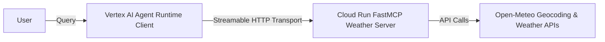

# Combined Model Context Protocol (MCP) & Vertex AI Agent Runtime Project

This repository acts as a combined layout/guide for hosting and deploying a Model Context Protocol (MCP) weather server on Google Cloud Run and configuring a Vertex AI Agent Runtime client agent to query it.

## Contents
- [cloud_run/](cloud_run/) - Cloud Run FastMCP Weather Server code and Dockerfile.
- [agent_runtime/](agent_runtime/) - Vertex AI Agent Runtime Client Agent code and configuration.
- [DEPLOYMENT.md](DEPLOYMENT.md) - Step-by-step guide covering GCP API setup, critical IAM permissions, and deployment instructions.

## High-Level Architecture

## Deployed Components
- **Server Endpoint (Cloud Run)**: Streamable HTTP endpoint at `/mcp`
- **Client Runtime (Agent Runtime)**: Runs a Gemini 2.5 Flash model equipped with the MCP toolset.

For detailed instructions on how to deploy these components, please refer to the [Deployment Guide](DEPLOYMENT.md).
